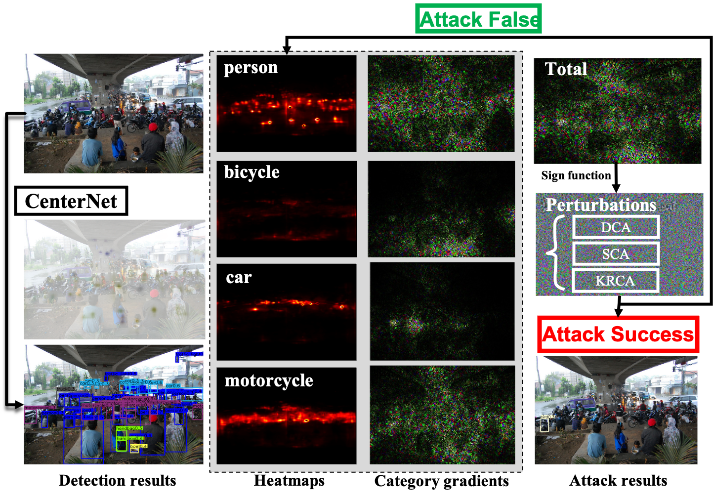

# Category-wise-Important-PIxel-Attack
# Background
Deep neural networks have been demonstrated to be vulnerable to adversarial attacks: subtle perturbation can completely  change the prediction result. Existing adversarial attacks on object detection focus on attacking anchor-based detectors, which may not work well for anchor-free detectors. We propose the first adversarial attack dedicated to anchor-free detectors. It is a  category-wise attack that attacks important pixels of all instances of a category simultaneously. Our attack manifests in two forms,  sparse category-wise attack (SCA) and dense category-wise attack (DCA), that minimize the L0 and L∞ norm-based perturbations,  respectively. For DCA, we present three variants, DCA-G, DCA-L, and DCA-S, that select a global region, a local region, and a  semantic region, respectively, to attack. Our experiments on large-scale benchmark datasets including PascalVOC, MS-COCO, and  MS-COCO Keypoints indicate that our proposed methods achieve state-of-the-art attack performance and transferability on both object  detection and human pose estimation task.
This document provides tutorials of Catergory-wise Important Pixel Attack framework.

# Getting Started
This document provides tutorials of Catergory-wise Important Pixel Attack framework.
Following the procedures below:
1) The experiments of this work is based on the target anchor-free object detector CenterNet, more details can be found at [Object as Points](http://arxiv.org/abs/1904.07850)
2) The basic installation procedures of CenterNet, all about is here [CenterNet Installation Procedures](INSTALL.md) 
3) Our work conducts experiments on PascalVOC and MS-COCO datasets, all relevant is here [Datasets Download](DATA.md).
4)  Download the backbone  networks you want to evaluate from the [model zoo](MODEL_ZOO.md) and move them in `Root_File/models/`. 
5) The installation procedures of [CWA framework](CWA_Installation.md).

# Run experiments
### Detection
To evaluate PascalVOC object detection
~~~
> Clean outputs:
> run:
python test.py ctdet --exp_id pascal_dla_1x_clean --dataset pascal --arch dla_34 --not_prefetch_test --load_model ../models/ctdet_pascal_dla_512.pth
~~~
~~~
> Adversarial outputs (DCA-G):
> run:
python test_universal.py ctdet --exp_id pascal_dla_1x_Uniattack --dataset pascal --arch dla_34 --not_prefetch_test --load_model ../models/ctdet_pascal_dla_512.pth
> Adversarial outputs (DCA-L):
> run:
python test_universal.py ctdet --exp_id pascal_dla_1x_Uniattack --dataset pascal --arch dla_34 --not_prefetch_test --load_model ../models/ctdet_pascal_dla_512.pth
> Adversarial outputs (DCA-S):
> run:
python test_universal.py ctdet --exp_id pascal_dla_1x_Uniattack --dataset pascal --arch dla_34 --not_prefetch_test --load_model ../models/ctdet_pascal_dla_512.pth
~~~

### Pose estimation
~~~
> Clean outputs:
> run:
python test.py multi_pose --exp_id coco_resdcn18_clean --dataset coco_hp --arch dla_34 --not_prefetch_test --load_model ../models/multi_pose_dla_1x.pth
~~~

~~~
> Adversarial outputs (DCA-G):
> run:
python test_universal.py multi_pose --exp_id coco_resdcn18_attack_uni --dataset coco_hp --arch dla_34 --not_prefetch_test --load_model ../models/multi_pose_dla_1x.pth
> Adversarial outputs (DCA-L):
> run:
python test_universal.py ctdet --exp_id pascal_dla_1x_Uniattack --dataset pascal --arch dla_34 --not_prefetch_test --load_model ../models/ctdet_pascal_dla_512.pth
> Adversarial outputs (DCA-S):
> run:
python test_universal.py ctdet --exp_id pascal_dla_1x_Uniattack --dataset pascal --arch dla_34 --not_prefetch_test --load_model ../models/ctdet_pascal_dla_512.pth
~~~

